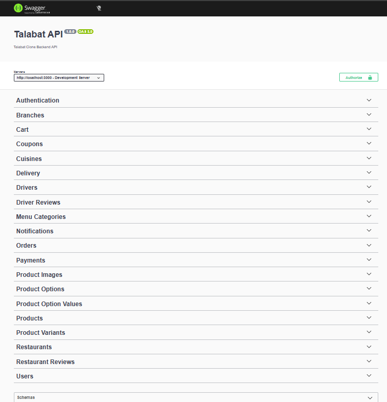
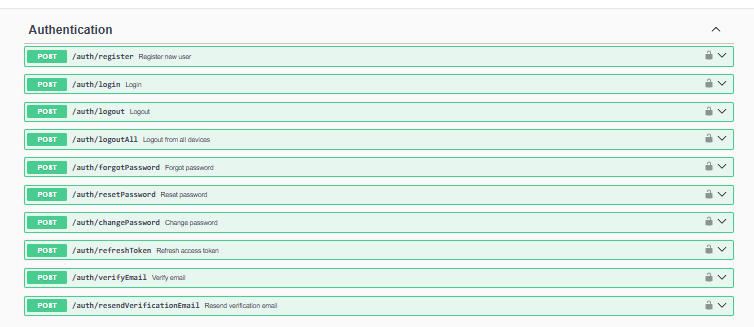
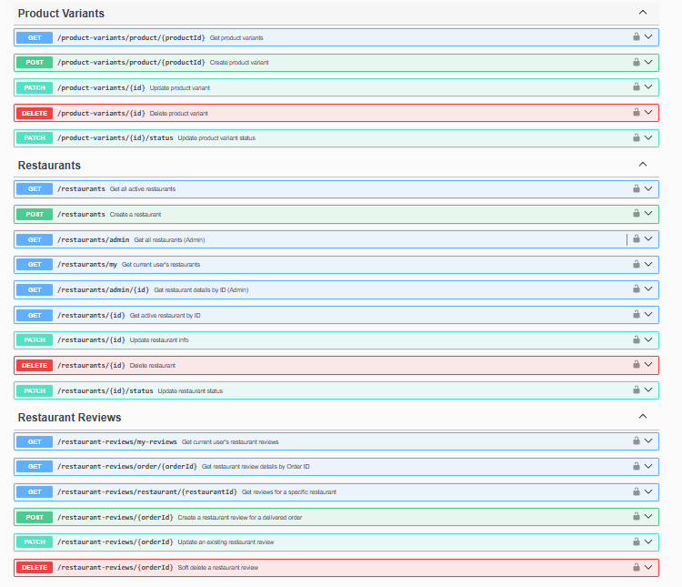
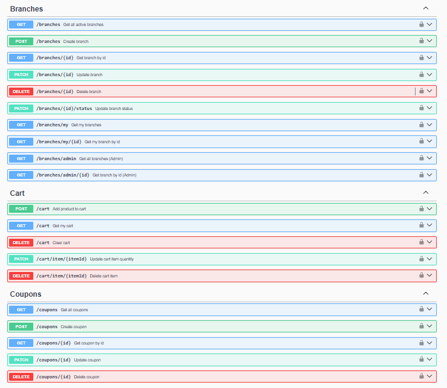
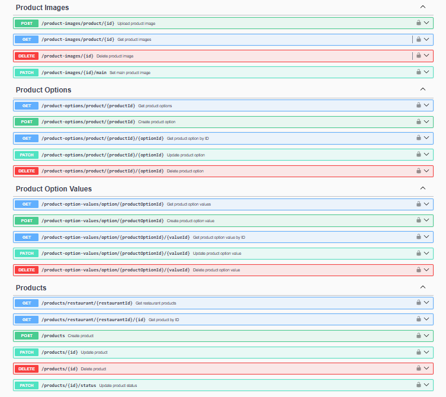
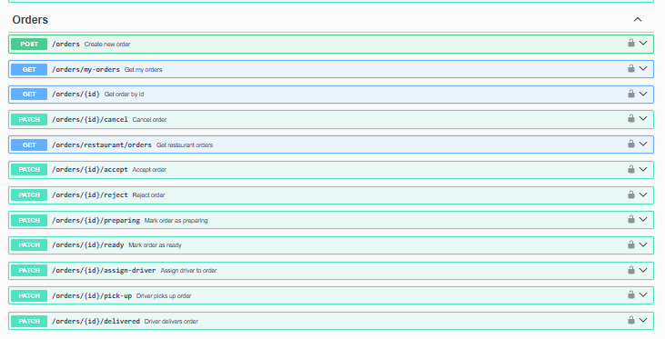

# 🍔 Talabat Clone Backend

A production-ready food delivery backend inspired by Talabat, designed using scalable architecture and modern backend engineering practices., built with **Node.js**, **Express.js**, **PostgreSQL**, **Prisma ORM**, **Redis**, **BullMQ**, **Socket.IO**, and **Docker**.

The project follows a scalable architecture with authentication, restaurant management, product management, carts, orders, payments, notifications, reviews, background jobs, and real-time communication.

---


## 📸 Swagger Documentation

A quick look at the available API documentation and endpoints.

---

## 🏠 API Home

<p align="center">
  
</p>

---

## 🔐 Authentication

<p align="center">
  
</p>

---

## 🍽 Restaurants

<p align="center">
  
</p>

---

## 🏢 Branches

<p align="center">
  
</p>

---

## 🍔 Products

<p align="center">
  
</p>

---

## 📦 Orders

<p align="center">
  
</p>

# ✨ Features

## 🔐 Authentication & Security

- JWT Authentication (Access Token & Refresh Token)
- Refresh Token Rotation
- HTTP Only Cookies
- Role-Based Authorization (RBAC)
- Password Hashing with bcrypt
- Email Verification
- Helmet Security
- HPP Protection
- Compression
- CORS
- Global Error Handler
- Request Logging (Morgan + Winston)

---

## 🍽 Restaurant Management

- Restaurants
- Restaurant Branches
- Branch Addresses
- Working Hours
- Restaurant Images
- Restaurant Cuisines
- Menu Categories

---

## 🍔 Product Management

- Products
- Product Variants
- Product Images
- Product Options
- Product Option Values
- Branch Product Availability

---

## 🛒 Customer Features

- Shopping Cart
- Coupons
- Orders
- Payments
- Delivery Tracking
- Notifications
- Restaurant Reviews
- Driver Reviews

---

## ⚡ Background Jobs

- BullMQ Workers
- Redis Queue
- Email Notifications

---

## 📡 Real-Time Features

- Socket.IO
- Live Notifications
- Live Order Updates

---

# 🛠 Tech Stack

## Backend

- Node.js
- Express.js

## Database

- PostgreSQL
- Prisma ORM

## Cache

- Redis

## Background Jobs

- BullMQ

## Realtime

- Socket.IO

## File Storage

- Cloudinary

## Documentation

- Swagger

## Containerization

- Docker
- Docker Compose

## Logging

- Winston
- Morgan

## Validation

- Joi

## Authentication

- JWT
- bcrypt

---

# 📁 Project Structure

```text
talbat/
│
├── config/
│   ├── cloudinary.js
│   ├── logger.js
│   ├── prisma.js
│   └── redis.js
│
├── prisma/
│   ├── schema/
│   ├── migrations/
│   └── seeds/
│
├── socket/
│   └── socket.js
│
├── workers/
│   └── notification.worker.js
│
├── src/
│   ├── controllers/
│   ├── middlewares/
│   ├── routes/
│   ├── services/
│   ├── repositories/
│   ├── validations/
│   ├── docs/
│   └── utils/
│
├── uploads/
│
├── Dockerfile
├── docker-compose.yml
├── index.js
├── package.json
└── README.md
```

---

# ⚙️ Environment Variables

Create a `.env` file in the project root.

```env
NODE_ENV=development

PORT=3000

DATABASE_URL=

JWT_SECRET_ACCESS_TOKEN=
JWT_SECRET_REFRESH_TOKEN=

EMAIL_USERNAME=
EMAIL_PASSWORD=

CLOUDINARY_CLOUD_NAME=
CLOUDINARY_API_KEY=
CLOUDINARY_API_SECRET=

REDIS_URL=
REDIS_HOST=
REDIS_PORT=
```

---

# 🐳 Docker Setup

Clone the repository

```bash
git clone https://github.com/essamalaa5500-hue/talbat-backend.git
```

Move into the project

```bash
cd talbat-backend
```

Build and start the containers

```bash
docker compose up --build -d
```

Stop containers

```bash
docker compose down
```

Stop containers and remove volumes

```bash
docker compose down -v
```

---

# 🚀 Installation (Without Docker)

Install dependencies

```bash
npm install
```

Generate Prisma Client

```bash
npx prisma generate
```

Run database migrations

```bash
npx prisma migrate deploy
```

Run development server

```bash
npm run dev
```

---

# 🌱 Database

Run migrations

```bash
npx prisma migrate deploy
```

Generate Prisma Client

```bash
npx prisma generate
```

Open Prisma Studio

```bash
npx prisma studio
```

Seed database

```bash
npm run seed
```

Check migration status

```bash
npx prisma migrate status
```

---

# 📚 API Documentation

Swagger documentation is available at

```
http://localhost:3000/api-docs
```

---

# 🐘 PostgreSQL

Access PostgreSQL container

```bash
docker exec -it talbat_postgres psql -U postgres -d talbat
```

---

# 🔴 Redis

Access Redis CLI

```bash
docker exec -it talbat_redis redis-cli
```

Check connection

```bash
PING
```

Expected response

```text
PONG
```

---

# 📝 Available Scripts

Start production server

```bash
npm start
```

Start development server

```bash
npm run dev
```

Debug mode

```bash
npm run debug
```

Seed database

```bash
npm run seed
```

---

# 🏗 Architecture

The project follows a layered architecture to keep the code clean, maintainable, and scalable.

```
Routes
   │
Controllers
   │
Services
   │
Repositories
   │
Prisma ORM
   │
PostgreSQL
```

Additional services:

- Redis (Caching & Queues)
- BullMQ (Background Jobs)
- Socket.IO (Realtime Events)
- Cloudinary (Image Storage)

---

# 📦 API Modules

The backend currently includes the following modules:

| Module                | Status |
| :-------------------- | :----: |
| Authentication        |   ✅   |
| Users                 |   ✅   |
| Drivers               |   ✅   |
| Restaurants           |   ✅   |
| Branches              |   ✅   |
| Cuisines              |   ✅   |
| Menu Categories       |   ✅   |
| Products              |   ✅   |
| Product Variants      |   ✅   |
| Product Images        |   ✅   |
| Product Options       |   ✅   |
| Product Option Values |   ✅   |
| Cart                  |   ✅   |
| Coupons               |   ✅   |
| Orders                |   ✅   |
| Payments              |   ✅   |
| Deliveries            |   ✅   |
| Restaurant Reviews    |   ✅   |
| Driver Reviews        |   ✅   |
| Notifications         |   ✅   |

---

# 🔒 Security

The backend implements several security best practices:

- JWT Authentication
- Refresh Tokens
- HTTP Only Cookies
- Password Hashing (bcrypt)
- Helmet
- HPP Protection
- Compression
- Rate Limiting
- Redis Session Storage
- Role-Based Authorization
- Global Error Handling
- Secure Environment Variables
- Redis Rate Limiting

---

# ⚡ Performance

The application is optimized using:

- Redis Caching
- BullMQ Background Jobs
- Compression Middleware
- Prisma Query Optimization
- Connection Pooling
- Docker Containers
- Connection Reuse
- Redis Cache Layer

---

# 📊 Database

Database Engine:

- PostgreSQL

ORM:

- Prisma ORM

Main Entities:

- Users
- Drivers
- Restaurants
- Branches
- Addresses
- Working Hours
- Products
- Product Variants
- Product Options
- Cart
- Orders
- Payments
- Deliveries
- Coupons
- Notifications
- Reviews

---

# 🚀 Future Improvements

Some planned features:

- Elasticsearch Search
- Payment Gateway Integration (Stripe / Paymob)
- SMS Verification
- Google Maps Distance Matrix
- Restaurant Analytics Dashboard
- Admin Dashboard
- Multi-language Support
- CI/CD Pipeline (GitHub Actions)
- Kubernetes Deployment
- Monitoring with Prometheus & Grafana

---

# 👨‍💻 Author

**Essam Alaa**

Node.js Backend Developer

GitHub:
https://github.com/essamalaa5500-hue

LinkedIn:
https://www.linkedin.com/in/essam-alaa-78496141b

---

# 🤝 Contributing

Contributions are welcome.

1. Fork the repository

2. Create your feature branch

```bash
git checkout -b feature/my-feature
```

3. Commit your changes

```bash
git commit -m "Add new feature"
```

4. Push the branch

```bash
git push origin feature/my-feature
```

5. Open a Pull Request

---

# 📄 License

This project is licensed under the MIT License.

---

# ⭐ Support

If you like this project, consider giving it a **Star ⭐** on GitHub.

It helps others discover the project and supports future development.

---

# ❤️ Built With

- Node.js
- Express.js
- PostgreSQL
- Prisma ORM
- Redis
- BullMQ
- Socket.IO
- Cloudinary
- Docker
- Swagger
- Winston
- JWT
